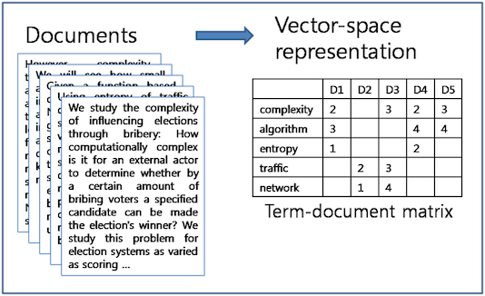

```{r setup, include=FALSE}
knitr::opts_chunk$set(echo = FALSE)
library("quanteda")
library("readtext")
library("RTextTools")
library("topicmodels")
library("stm")
library("spacyr")
library("tidyverse")
library("lubridate")
library("RColorBrewer")
theme_set(theme_bw())
```

These is a very verbose code documentation of a talk that I held at the Social Science Data Lab at the [Mannheimer Zentrum für Europäische Sozialforschung (MZES)](https://www.mzes.uni-mannheim.de/d7/en) upon invitation from [Christiane Grill](https://www.mzes.uni-mannheim.de/d7/de/profiles/christiane-grill. Thanks for having me!

## Overview of this talk

1. Why quanteda?
2. Using quanteda
3. Applying dictionaries
4. Unsupervised machine learning
5. Supervised machine learning
6. Closing remarks


## Why quanteda?

- fully-featured
- great performance
- extensive [documentation](http://quanteda.io)
- regulary updates


## Why quanteda?

- "competitors" include [tm](https://cran.r-project.org/web/packages/tm/vignettes/tm.pdf), [tidytext](https://www.tidytextmining.com/) and [korpus](https://cran.r-project.org/web/packages/koRpus/vignettes/koRpus_vignette.html)
- tidytext is very closely integrated with dplyr and well-documented
- tm has simpler grammer but slightly fewer features
- korpus is good for certain tasks (e.g. POS)
- other useful packages: [tidyverse](https://www.tidyverse.org/), [RTextTools](http://www.rtexttools.com/), [stm](https://www.structuraltopicmodel.com/)


## Using quanteda

Most analyses with quanteda onsist of three steps:

1. Import the data
2. Build a corpus
3. Calculate a DFM




## Using quanteda: Reading data

```{r Read data and generate corpus, echo = TRUE}
sherlock <- readtext("data/sherlock/novels/[0-9]*.txt") 
sherlock$doc_id <- str_sub(sherlock$doc_id, start = 4, end = -5)
mycorpus <- corpus(sherlock, docid_field = "doc_id")
docvars(mycorpus, "Textno") <- sprintf("%02d", 1:ndoc(mycorpus))
mycorpus
```


## Using quanteda: Generating corpus statistics

```{r Corpus stats, echo = TRUE}
mycorpus.stats <- summary(mycorpus)
mycorpus.stats$Text <- reorder(mycorpus.stats$Text, 1:ndoc(mycorpus), order = T)
mycorpus.stats
```


## Using quanteda: What makes DFMs nifty

Things to remember about DFMS:

- a corpus is positional, a DFM is non-positional
- in most projects you want one corpus to contain all your data and generate many DFMs from that
- the rows of a DFM can contain any unit on which you can aggregates documents
- the columns of a DFM are any unit on which you can aggregate features


## Using quanteda: Calculating a DFM (1)

```{r Generate a simple DFM, echo = TRUE}
mydfm <- dfm(mycorpus, remove_numbers = TRUE, remove_punct = TRUE, remove_symbols = TRUE, remove = stopwords("english"))
mydfm

head(dfm_sort(mydfm, decreasing = TRUE, margin = "both"), n = 12, nf = 10) 
```

## Using quanteda: Calculating a DFM (2)

```{r Calculate and weight a grouped DFM, echo = TRUE}
load("data/euspeech/euspeech.korpus.RData")
korpus.euspeech
mydfm.eu <- dfm(korpus.euspeech, groups = "Typ")
mydfm.eu.prop <- dfm_weight(mydfm.eu, scheme = "prop")
head(dfm_sort(mydfm.eu.prop, decreasing = TRUE, margin = "both"), nf = 8) 
```


## Applying dictionaries: Defining an ad-hoc dictionary

```{r Define an ad-hoc dictionary, echo = TRUE}
populism.liberalism.dict <- dictionary(list(populism = c("elit*", "consensus*", "undemocratic*", "referend*", "corrupt*", "propagand", "politici*", "*deceit*", "*deceiv*", "*betray*", "shame*", "scandal*", "truth*", "dishonest*", "establishm*", "ruling*"), liberalism = c("liber*", "free*", "indiv*", "open*", "law*", "rules", "order", "rights", "trade", "global", "inter*", "trans*", "minori*", "exchange", "market*")))
populism.liberalism.dict
```


## Applying dictionaries: Applying an ad-hoc dictionary
```{r Apply an ad-hoc dictionary, echo = TRUE}
mydfm.eu <- dfm(korpus.euspeech, dictionary = populism.liberalism.dict)
mydfm.eu.prop <- dfm_weight(mydfm.eu, scheme = "prop")
eu.poplib <- convert(mydfm.eu.prop, "data.frame") %>% 
  bind_cols(korpus.euspeech.stats) %>% 
  filter(length >= 1200, populism > 0 | liberalism > 0)
ggplot(eu.poplib, aes(country, populism)) + geom_boxplot(outlier.size = 0) + geom_jitter(aes(country,populism), position = position_jitter(width = 0.4, height = 0), alpha = 0.1, size = 0.2, show.legend = F) + theme(axis.text.x = element_text(angle = 45, vjust = 1, hjust = 1)) + xlab("") + ylab("Populism share") + ggtitle("Populism share in the EUspeech corpus based on our ad-hoc dictionary (%)")
```


## Applying dictionaries: Lexicoder Policy Agendas (PA)

```{r Load and apply PA dictionary, echo = TRUE}
load("dictionaries/policy_agendas_english.RData")
policyagendas.dict <- dictionary(dictLexic2Topics)
mydfm.eu.pa <- dfm(korpus.euspeech, groups = "country", dictionary = policyagendas.dict)
eu.topics.pa <- convert(mydfm.eu.pa, "data.frame") %>%
  rename(Land = document) %>%
  select(Land, macroeconomics, finance, foreign_trade, labour, healthcare, immigration, education, intl_affairs, defence) %>%
  gather(macroeconomics:defence, key = "Thema", value = "Anteil") %>% 
  group_by(Land) %>% 
  mutate(Anteil = Anteil/sum(Anteil)) %>% 
  mutate(Thema = as_factor(Thema))
ggplot(eu.topics.pa, aes(Land, Anteil, colour = Thema, fill = Thema)) + geom_bar(stat="identity") + scale_colour_brewer(palette = "Set1") + scale_fill_brewer(palette = "Pastel1") + ggtitle("Distribution of PA topics in the EUspeech corpus") + xlab("") + ylab("Topic share (%)") + theme(axis.text.x = element_text(angle = 45, hjust = 1))
```


## Dictionaries: LIWC German (1)

```{r Load Facebook data, echo = TRUE}
load("data/facebook/facebook.korpus.RData")
korpus.facebook
texts(corpus_sample(corpus_subset(korpus.facebook, corpus == "populism"), size = 1))
texts(corpus_sample(corpus_subset(korpus.facebook, corpus == "news"), size = 1))
```


## Dictionaries: LIWC German (2)

```{r Plot Facebook activity over time, echo = TRUE}
facebook.aktivitaet <- korpus.facebook.stats %>%
  mutate(Quelle = factor(source, levels = c("pegidaevdresden", "alternativefuerde", "FAZ", "SZ", "Welt", "Zeit"))) %>% 
  group_by(Datum = floor_date(created_time, "1 month"), Quelle) %>%
  summarise(Kommentare = n())
ggplot(facebook.aktivitaet, aes(as.Date(Datum), Kommentare, group = Quelle, col = Quelle)) + geom_line(size = 1) + scale_colour_brewer(palette = "Set1") + scale_x_date(date_breaks = "2 months", date_labels = "%b %Y") + ggtitle("Volume of comments on six public Facebook pages") + xlab("") + ylab("") + theme(axis.text.x = element_text(angle = 45, hjust = 1))
```


## Dictionaries: LIWC German (3)

```{r Import LIWC German, echo = TRUE}
liwc.ger <- dictionary(file = "dictionaries/LIWC_German.dic", format = "LIWC")
head(liwc.ger, 2)
```


## Dictionaries: LIWC German (4)

```{r Apply LIWC to Facebook data and plot distribution, echo = TRUE}
mydfm.fb.liwc <- dfm(korpus.facebook, groups = "corpus", dictionary = liwc.ger)
liwc.shares <- convert(mydfm.fb.liwc, "data.frame") %>%
  rename(Korpus = document) %>% 
  gather(key = Kategorie, value = Words, -Korpus) %>% 
  filter(!Kategorie %in% c("Article", "Down", "Eat", "Fillers", "Grooming", "Humans", "Money", "Motion", "Music", "Nonfluency", "Numbers", "Physical", "Preps", "Relig", "Sex", "Sleep", "Sports", "Time", "Up")) %>% 
  mutate(Korpus = factor(Korpus, levels = c("populism", "news")))
ggplot(liwc.shares, aes(Kategorie, Words, fill = Korpus)) + geom_bar(stat = "identity", position = position_dodge()) + scale_fill_brewer(palette = "Set1") + ggtitle("Share of LIWC categories in Facebook comments by page") + xlab("LIWC categories") + theme(axis.text.x = element_text(size = 7, angle = 45, hjust = 1))
```


## Unsupervised machine learning: Latent semantic analysis (LSA)

- LSA is a useful technique for aligning feature distributions to an n-dimensional space
- this is achieved via singular value decomposition (SVDS)
- LSA can (among other things) be used to compare similarity of documents/documents grouped by some variable


## Unsupervised machine learning: Latent semantic analysis (LSA)

```{r, Apply LSA to Facebook data and plot, echo = TRUE}
korpus.facebook.sample <- corpus_sample(korpus.facebook, size = 500)
mydfm.fb <- dfm(korpus.facebook.sample)
mylsa <- textmodel_lsa(mydfm.fb, nd = 10)
sources <- str_remove_all(rownames(mylsa$docs), "[0-9]")
sources.color <- rep("blue", times = length(sources))
sources.color[sources %in% c("alternativefuerde", "pegidaevdresden")] <- "red"
plot(mylsa$docs[,1:2], col = sources.color, pch = 19, xlab = "Dimension 1", ylab = "Dimension 2", main = "LSA dimensions by subcorpus")
plot(mylsa$docs[,2:3], col = sources.color, pch = 19, xlab = "Dimension 2", ylab = "Dimension 3", main = "LSA dimensions by subcorpus")
plot(mylsa$docs[,3:4], col = sources.color, pch = 19, xlab = "Dimension 3", ylab = "Dimension 4", main = "LSA dimensions by subcorpus")
plot(mylsa$docs[,4:5], col = sources.color, pch = 19, xlab = "Dimension 4", ylab = "Dimension 5", main = "LSA dimensions by subcorpus")
plot(mylsa$docs[,5:6], col = sources.color, pch = 19, xlab = "Dimension 5", ylab = "Dimension 6", main = "LSA dimensions by subcorpus")
plot(mylsa$docs[,6:7], col = sources.color, pch = 19, xlab = "Dimension 6", ylab = "Dimension 7", main = "LSA dimensions by subcorpus")
plot(mylsa$docs[,7:8], col = sources.color, pch = 19, xlab = "Dimension 7", ylab = "Dimension 8", main = "LSA dimensions by subcorpus")
plot(mylsa$docs[,8:9], col = sources.color, pch = 19, xlab = "Dimension 8", ylab = "Dimension 9", main = "LSA dimensions by subcorpus")
plot(mylsa$docs[,9:10], col = sources.color, pch = 19, xlab = "Dimension 9", ylab = "Dimension 10", main = "LSA dimensions by subcorpus")
```


## Unsupervised machine learning: LDA (1)

```{r, Load Die Zeit data, echo = TRUE}
load("data/zeit/zeit.sample.korpus.RData")
as.data.frame(zeit.korpus.stats)
```


## Unsupervised machine learning: LDA (2)

```{r, Fit a DFM and trim, echo = TRUE}
mydfm.zeit <- dfm(zeit.korpus, remove_numbers = TRUE, remove_punct = TRUE, remove_symbols = TRUE, remove = stopwords("german"))
mydfm.zeit.trim <-  dfm_trim(mydfm.zeit, min_docfreq = 3, max_docfreq = 65)
mydfm.zeit.trim
```


## Unsupervised machine learning: LDA (3)

```{r, Apply LDA, echo = TRUE}
topic.count <- 15
dfm2topicmodels <- convert(mydfm.zeit.trim, to = "topicmodels")
lda.model <- LDA(dfm2topicmodels, topic.count)
lda.model
```


## Unsupervised machine learning: LDA (4)

```{r, Show key LDA terms, echo = TRUE}
as.data.frame(terms(lda.model, 6))
```


## Unsupervised machine learning: LDA (5)

```{r, Plot topic similarity, echo = TRUE}
lda.similarity <- as.data.frame(lda.model@beta) %>% 
  scale() %>% 
  dist(method = "euclidean") %>% 
  hclust(method = "ward.D2")
par(mar = c(0, 4, 4, 2))
plot(lda.similarity, main = "LDA topic similarity by features", xlab = "", sub = "")
```


## Unsupervised machine learning: STM (1)

- structured topic models (STM) are a popular alternative to standard LDA
- alternative initialization mechanism ("Spectral")
- covariatees can be used in priors
- emphasis on a number of diagnostic functions integrated into the R package
- very useful: [stminsights](https://cran.r-project.org/web/packages/stminsights/vignettes/intro.html) package for visual exploration!


## Unsupervised machine learning: STM (2)

```{r, Load UN corpus and plot wordclouds/summary, echo = TRUE}
load("data/un/un.stm.RData")
par(mar=c(0.5, 0.5, 0.5, 0.5))
cloud(modell.stm, topic = 1, scale = c(2.25,.5))
cloud(modell.stm, topic = 2, scale = c(2.25,.5))
cloud(modell.stm, topic = 7, scale = c(2.25,.5))
cloud(modell.stm, topic = 9, scale = c(2.25,.5))
plot(modell.stm, type = "summary", text.cex = 0.5, main = "STM topic shares", xlab = "Share estimation")
```


## Supervised machine learning: NB classifier (1)

```{r, Load NYT headline corpus and category labels, echo = TRUE}
load("data/nytimes/nyt.korpus.RData")
korpus.nyt
labels.cats <- scan("data/nytimes/majortopics2digits.txt", what = "char", sep = "\n", quiet = T)
labels.cats <- data.frame(Kategorie = as.character(1:length(labels.cats)), Label = labels.cats, stringsAsFactors = F)
labels.cats
```


## Supervised machine learning: NB classifier (2)

```{r, Calculate and trim DFM, echo = TRUE}
mydfm.nyt <- dfm(korpus.nyt, remove_numbers = TRUE, remove_punct = TRUE, remove = stopwords("english"))
mydfm.nyt
mydfm.nyt.trim <- dfm_trim(mydfm.nyt, min_docfreq = 0.0005, docfreq_type = "prop") # optional: min_count = 10
mydfm.nyt.trim
```


## Supervised machine learning: NB classifier (3)

```{r, Apply NB classifer, echo = TRUE}
modell.NB <- textmodel_nb(mydfm.nyt.trim, korpus.nyt.stats$Topic_2digit, prior = "docfreq")
head(as.character(predict(modell.NB)))
prop.table(table(predict(modell.NB) == korpus.nyt.stats$Topic_2digit))*100
prop.table(table(sample(predict(modell.NB)) == korpus.nyt.stats$Topic_2digit))*100
```


## Supervised machine learning: NB classifier (4)

```{r, Plot NB classifier accuracy by category, echo = TRUE}
model.NB.classification <- bind_cols(korpus.nyt.stats, Klassifikation = as.character(predict(modell.NB))) %>%
  mutate(Kategorie = as.character(Topic_2digit)) %>% 
  mutate(RichtigKodiert = Klassifikation == Kategorie) %>% 
  group_by(Kategorie, RichtigKodiert) %>% 
  summarise(n = n()) %>% 
  mutate(Anteil = n/sum(n)) %>% 
  filter(RichtigKodiert == TRUE) %>% 
  left_join(labels.cats, by = "Kategorie") %>% 
  select(Kategorie, Label, n, Anteil)
ggplot(model.NB.classification, aes(Label, Anteil)) + geom_bar(stat = "identity") + geom_hline(yintercept = mean(model.NB.classification$Anteil), color = "blue") + ylim(0, 1) + ggtitle("Share of correctly classified texts in 26\ncontent categories with a Naive Bayes classifier") + xlab("") + ylab("") + coord_flip()
```


## Supervised machine learning: RTextTools (1)

```{r, Prepare container for SML with RTextTools, echo = TRUE}
container <- create_container(convert(mydfm.nyt.trim, to = "matrix"), korpus.nyt.stats$Topic_2digit, trainSize = 1:27775, testSize = 27776:30862, virgin = FALSE)
```


## Supervised machine learning: RTextTools (2)

```{r, Load pre-trained models, echo = TRUE}
load("data/nytimes/nyt.modelle.RData")

# primäre Modelle
#modell.SVM <- train_model(container,"SVM")
#modell.GLMNET <- train_model(container,"GLMNET")
#modell.MAXENT <- train_model(container,"MAXENT")
#modell.SLDA <- train_model(container,"SLDA")

# weitere Modelle, funktionieren z.T. nicht
#modell.BOOSTING <- train_model(container,"BOOSTING")
#modell.BAGGING <- train_model(container,"BAGGING")
#modell.RF <- train_model(container,"RF")
#modell.NNET <- train_model(container,"NNET")
#modell.TREE <- train_model(container,"TREE")
```


## Supervised machine learning: RTextTools (3)

```{r, Classify using four RTextTools algorithms, echo = TRUE}
SVM_CLASSIFY <- classify_model(container, modell.SVM)
GLMNET_CLASSIFY <- classify_model(container, modell.GLMNET)
MAXENT_CLASSIFY <- classify_model(container, modell.MAXENT)
SLDA_CLASSIFY <- classify_model(container, modell.SLDA)
#BOOSTING_CLASSIFY <- classify_model(container, modell.BOOSTING)
#BAGGING_CLASSIFY <- classify_model(container, modell.BAGGING)
#RF_CLASSIFY <- classify_model(container, modell.RF)
#NNET_CLASSIFY <- classify_model(container, modell.NNET)
#TREE_CLASSIFY <- classify_model(container, modell.TREE)
```


## Supervised machine learning: RTextTools (4)

```{r, Generate RTextTools analytics, echo = TRUE}
analytics <- create_analytics(container, cbind(SVM_CLASSIFY, GLMNET_CLASSIFY, MAXENT_CLASSIFY, SLDA_CLASSIFY))
summary(analytics)
```


## Supervised machine learning: RTextTools (5)

```{r, Prepare RTextTools analytics for plotting, echo = TRUE}
topic.codes <- scan("data/nytimes/majortopics2digits.txt", what = "char", sep = "\n", quiet = T)
topic.codes <- data.frame(category = as.factor(1:length(topic.codes)), category.label = topic.codes)
algdf <- data.frame(algorithm = str_split(colnames(analytics@algorithm_summary), "_", simplify = T)[,1], measure = factor(str_split(colnames(analytics@algorithm_summary), "_", simplify = T)[,2], levels = str_split(colnames(analytics@algorithm_summary), "_", simplify = T)[1:3,2]), category = factor(rep(rownames(analytics@algorithm_summary), each = ncol(analytics@algorithm_summary)), levels = rownames(analytics@algorithm_summary)), score = as.vector(t(analytics@algorithm_summary)))
algdf <- left_join(algdf, topic.codes, by = "category")
```


## Supervised machine learning: RTextTools (6)

```{r, Plot RTextTools analytics, echo = TRUE}
algdf <- filter(algdf, category.label %in% c("Civil Rights, Minority Issues, and Civil Liberties", "Education", "Environment", "Law, Crime, and Family Issues", "Macroeconomics", "Sports and Recreation"))
ggplot(algdf, aes(score, algorithm, color = measure, shape = measure)) + geom_point(size = 1.75) + facet_grid(category.label ~ ., switch = "y") + xlim(c(0,1)) + theme(strip.text.y = element_text(angle = 180)) + scale_colour_manual(values = c("lightblue", "lightgreen", "red")) + ggtitle("Precision, recall and f-score for four\nalgorithms measured across six\ncontent categories") + xlab("") + ylab("")
```


## Closing remarks

- quanteda is useful for preparing data that is then subjected to UML/SML/other techniques
- combination with tidyverse leads to more transparent code
- a lot of useful areas I haven't addressed (scaling models, POS tagging, named entities, word embeddings...)
- [validate, validate, validate](https://web.stanford.edu/~jgrimmer/tad2.pdf)

